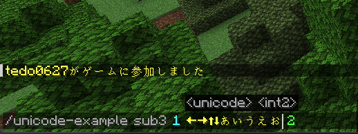

# commandapi-unicode-argument

[English](README.md)

このライブラリは、[CommandAPI](https://github.com/CommandAPI/CommandAPI)でUnicodeを入力する方法を追加するものです。

CommandAPIの引数は[Brigadier](https://github.com/Mojang/brigadier)の仕様により、Unicodeを入力する際に`TextArgument`を使用しダブルクォーテーションで囲むか、`GreedyStringArgument`を使うしか方法がなかった。

## image



## setup

`build.gradle.kts`
```kotlin
repositories {
    mavenCentral()
    maven {
        url = uri("https://jitpack.io")
    }
}

dependencies {
    implementation("dev.jorel:commandapi-paper-shade:12.0.0")
    implementation("dev.jorel:commandapi-kotlin-paper:12.0.0") // optional
    implementation("com.github.tedo0627.commandapi-unicode-argument:core:1.1.0")
    implementation("com.github.tedo0627.commandapi-unicode-argument:kotlin:1.1.0") // optional
}
```

## usage

`java`
```java
CommandAPICommand command = new CommandAPICommand("my-command");
command.withArguments(new UnicodeArgument("unicode"));
command.executesPlayer((player, args) -> {
    String input = args.getOrDefaultUnchecked(0, "");
    player.sendMessage("your input is " + input);
});
```

`kotlin`
```kotlin
val command = CommandAPICommand("my-command")
command.unicodeArgument("unicode")
command.playerExecutor { player, args ->
    val input = args.getOrDefaultUnchecked(0, "")
    player.sendMessage("your input is $input")
}
```
